# 엣지 VLM 해석 평가 (i_768)

## 데이터셋 구성 (위험 3종 + 정상)

| 카테고리 | 정답 | 위험유형 | 이미지 |
|---|---|---|---|
| 화재 (`fire`) | 위험 | 화재 | 6 |
| 연기 (`smoke`) | 위험 | 화재 | 7 |
| 사람 쓰러짐/낙상 (`person_fall`) | 위험 | 낙상 | 5 |
| 기계·장비 전도 (`machine_tipover`) | 위험 | 전도 | 6 |
| 정상 주차장(오탐 테스트) (`normal_parking`) | 정상 | 없음 | 5 |
| 정상 작업장(오탐 테스트) (`normal_worker`) | 정상 | 없음 | 5 |

## 모델 종합 비교

| 모델 | 로드 | 상황인식 정확도 | 유형 정확도 | 과잉해석(오탐) | 평균 지연 | tok/s | peak VRAM |
|---|---|---|---|---|---|---|---|
| Qwen3-VL-2B-Instruct | ✅ 7.71s | 94% | 71% | 10% | 2.46s | 32.0 | 4355 MB |

## Qwen3-VL-2B-Instruct — `Qwen/Qwen3-VL-2B-Instruct`

**위험 유형별 인식 (카테고리별 정답률)**

| 카테고리 | 정답유형 | N | 위험판정 | 판정정답률 | 유형정답률 | 미상 |
|---|---|---|---|---|---|---|
| 화재 | 화재 | 6 | 6 | 100% | 83% | 0 |
| 연기 | 화재 | 7 | 6 | 86% | 71% | 0 |
| 사람 쓰러짐/낙상 | 낙상 | 5 | 5 | 100% | 100% | 0 |
| 기계·장비 전도 | 전도 | 6 | 6 | 100% | 0% | 0 |
| 정상 주차장(오탐 테스트) | 없음 | 5 | 0 | 100% | 100% | 0 |
| 정상 작업장(오탐 테스트) | 없음 | 5 | 1 | 80% | 80% | 0 |

**항목별 결과**

| 유형 | 정답 | 판정 | 정오 | 시간 | 해석(앞부분) |
|---|---|---|---|---|---|
| 낙상 | 위험 | 위험 | ✅ | 2.4s | 캐릭터가 높은 위치에서 무게를 가진 물체를 떨어뜨리는 것을 보여주며, 이는 낙상의 위험을 나타냅니다… |
| 화재 | 위험 | 위험 | ✅ | 2.5s | 화재 현장에서 소방관이 빛을 내는 방향으로 접근하고 있으며, 불꽃이 있는 벽면과 함께 연기와 함께 … |
| 화재 | 위험 | 위험 | ✅ | 2.3s | 화재 현장에서 소방관이 대응하고 있으며, 빛이 강하게 떨어지는 상태로 불꽃이 매우 크며, 주변은 붉… |
| 화재 | 위험 | 위험 | ✅ | 2.1s | 화면 왼쪽에서 강한 불꽃과 빛이 나오며, 주변은 붉은색으로 변해 있어 화재가 발생한 것으로 보입니다… |
| 화재 | 위험 | 위험 | ✅ | 3.0s | 파란색 기아 차량이 불꽃으로 끼워져 있으며, 주변에는 사람들이 모여 있는 것으로 보이며, 화재가 발… |
| 화재 | 위험 | 위험 | ✅ | 2.0s | 차량의 앞쪽 바퀴 부위에서 빠르게 번지는 연기와 함께 불꽃이 발생하고 있으며, 차량은 안전한 상태가… |
| 낙상 | 위험 | 위험 | ✅ | 1.7s | 산악 지역에서 기계가 떨어진 상태로 위험한 상황이며, 인근에는 구조대원들이 대응하고 있습니다. |
| 낙상 | 위험 | 위험 | ✅ | 3.8s | 트럭이 완전히 바닥에 떨어져 있으며, 그 위에 있는 크레인 기구가 휘어져 있다. 이는 매우 위험한 … |
| 낙상 | 위험 | 위험 | ✅ | 2.2s | 녹색 토목 기계가 운전사의 손을 잡고 있는 상태에서, 그 기계가 떨어질 위험이 존재합니다. 이는 기… |
| 낙상 | 위험 | 위험 | ✅ | 2.4s | 트럭이 뒤에서 떨어지는 듯한 모습이 보이며, 그 과정에서 먼지와 물이 방출되고 있다. 이는 낙상의 … |
| 낙상 | 위험 | 위험 | ✅ | 2.4s | 작업 중인 인물이 물건을 운반하는 데 중간에 떨어뜨린다. 이는 물건이 무게를 견딜 수 없는 상태로,… |
| 낙상 | 위험 | 위험 | ✅ | 3.7s | 빨간색 트럭이 바닥에 떨어져 있으며, 그 위에 있는 물건들이 흩어져 있다. 이는 낙상의 위험을 나타… |
| 없음 | 정상 | 정상 | ✅ | 2.9s | 화면에는 차량이 정차하고 있으며, 인물은 주변을 걷고 있는 것으로 보이며, 주변 환경은 안정적인 상… |
| 없음 | 정상 | 정상 | ✅ | 2.3s | 이미지에는 차량이 정지해 있는 것으로 보이며, 인공지능이 감지한 위험 요소는 없습니다. 주변 환경은… |
| 없음 | 정상 | 정상 | ✅ | 3.2s | 화면에는 차량들이 정지된 상태로 주차되어 있으며, 불안정한 위치나 빠른 이동, 또는 불꽃 등 위험 … |
| 없음 | 정상 | 정상 | ✅ | 1.9s | 화면에는 차량이 운행하고 있으며, 주차장과 도로가 보이며, 현재는 아무런 위험 요소가 보이지 않습니… |
| 없음 | 정상 | 정상 | ✅ | 2.9s | 화면에는 차량들이 정지된 상태로 주차되어 있으며, 주변에는 특별한 위험 요소나 불안정한 상태가 보이… |
| 없음 | 정상 | 정상 | ✅ | 2.3s | 화면에는 작업 중인 직원들과 수많은 박스가 보이며, 모든 장비와 인물은 안전하게 작동하고 있는 것으… |
| 없음 | 정상 | 정상 | ✅ | 1.5s | 장소는 공장 내부이며, 작업자와 물품이 정상적으로 배치되어 있으며, 위험 요소가 보이지 않습니다. |
| 낙상 | 정상 | 위험 | ❌ | 2.4s | 상단에서 높은 위치에 있는 사람이 있는 것으로 보이며, 그 아래쪽에는 낙하 위험을 가진 물체가 존재… |
| 없음 | 정상 | 정상 | ✅ | 2.2s | 공장 내부의 작업 공간에서 여러 명의 직원들이 작업을 하고 있으며, 안전 장비나 경고 시스템이 보이… |
| 없음 | 정상 | 정상 | ✅ | 5.0s | 재난 현장의 엣지 카메라로 캡처된 장면에서, 두 사람이 밀폐된 공간 내에 큰 수량의 상자와 포장재를… |
| 낙상 | 위험 | 위험 | ✅ | 2.0s | 작업자가 포크세터에 부딪혀 넘어진 상태이며, 이는 높은 위험을 의미합니다. 작업자의 안전을 보장하기… |
| 낙상 | 위험 | 위험 | ✅ | 2.5s | 작업 중인 인물이 무릎을 꿇고 넘어진 상태이며, 주변에는 건설 현장의 폐쇄된 콘크리트 조각들이 뒤섞… |
| 낙상 | 위험 | 위험 | ✅ | 2.1s | 이미지 하단에는 작업복을 입은 인물이 바닥에 무릎을 꿇고 있으며, 그의 몸이 바닥에 떨어진 상태로 … |
| 낙상 | 위험 | 위험 | ✅ | 2.1s | 화면에 보이는 인물이 바닥에 떨어진 상태이며, 이는 낙상의 위험을 나타냅니다. 이는 즉각적인 위험을… |
| 낙상 | 위험 | 위험 | ✅ | 2.0s | 방 안에 사람이 무릎을 꿇고 바닥에 떨어진 상태로 누워 있으며, 이는 낙상 위험을 나타냅니다. 이는… |
| 화재 | 위험 | 위험 | ✅ | 2.6s | 화재 발생 후 연기와 함께 인원이 무릎을 꿇고 있는 상태이며, 주변에는 흐릿한 연기와 함께 여러 개… |
| 화재 | 위험 | 위험 | ✅ | 2.2s | 화재 발생 후 연기와 불꽃이 확산되고 있으며, 작업자들이 급히 뒤로 물러나는 상황. 이는 매우 심각… |
| 화재 | 위험 | 위험 | ✅ | 2.6s | 차량의 앞부분에서 밀집된 연기와 함께 빛이 흐르는 상태로, 차량이 불이 나는 것으로 보이며, 이는 … |
| 없음 | 위험 | 정상 | ❌ | 2.9s | 화면에는 오일 및 가스 플랜트 관련 장비가 보이며, 실내는 잘 관리된 상태로 보이며, 불안정한 상태… |
| 화재 | 위험 | 위험 | ✅ | 2.0s | 이미지 하단에는 연기와 함께 불꽃이 나는 장비가 보이며, 이는 화재 발생의 시각적 증거입니다. 이는… |
| 화재 | 위험 | 위험 | ✅ | 1.4s | 화재가 발생한 것으로 보이며, 빛이 흐르는 상태로 인해 위험한 상황이 발생하고 있습니다. |
| 낙상 | 위험 | 위험 | ✅ | 2.2s | 화면 중앙에 인물이 바닥에 누워 있으며, 그 주변에는 빛이 나는 불꽃이 발생하고 있다. 이는 낙상 … |

## 상세 내역 

### Qwen3-VL-2B-Instruct

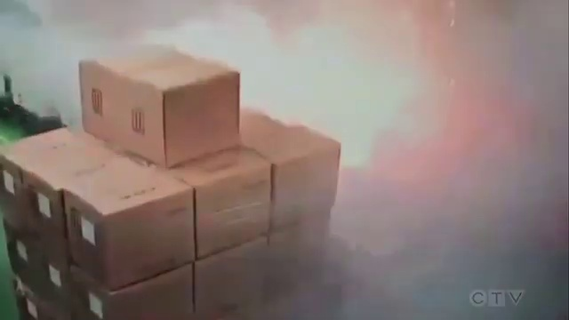

[image] fire1.jpg · 정답 위험 · 판정 위험(낙상) ✅

판정 위험   유형 낙상   설명 캐릭터가 높은 위치에서 무게를 가진 물체를 떨어뜨리는 것을 보여주며, 이는 낙상의 위험을 나타냅니다.

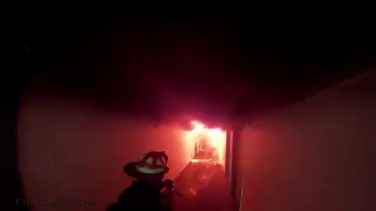

[image] fire2.jpg · 정답 위험 · 판정 위험(화재) ✅

판정 위험   유형 화재   설명 화재 현장에서 소방관이 빛을 내는 방향으로 접근하고 있으며, 불꽃이 있는 벽면과 함께 연기와 함께 빛이 나는 상태로, 위험한 상황임을 알 수 있음.

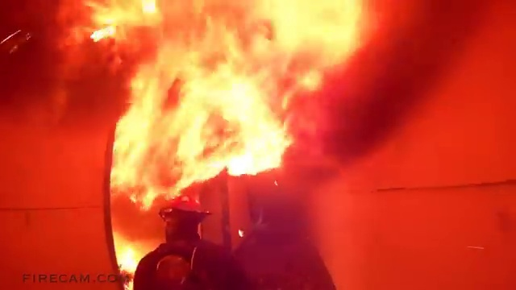

[image] fire3.jpg · 정답 위험 · 판정 위험(화재) ✅

판정 위험   유형 화재   설명 화재 현장에서 소방관이 대응하고 있으며, 빛이 강하게 떨어지는 상태로 불꽃이 매우 크며, 주변은 붉은색으로 물들어 있어 위험한 상황임을 알 수 있음.

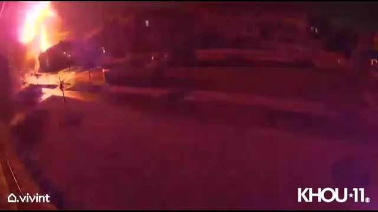

[image] fire4.jpg · 정답 위험 · 판정 위험(화재) ✅

판정 위험   유형 화재   설명 화면 왼쪽에서 강한 불꽃과 빛이 나오며, 주변은 붉은색으로 변해 있어 화재가 발생한 것으로 보입니다. 이는 매우 심각한 위험을 나타냅니다.

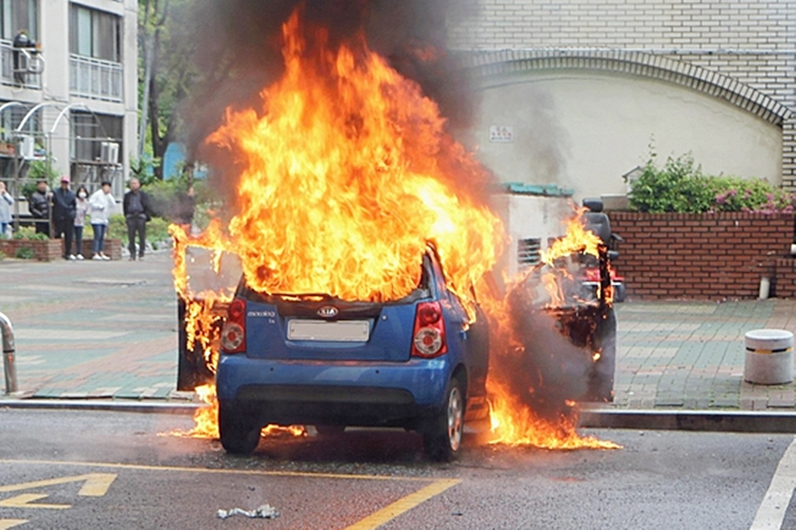

[image] fire5.jpg · 정답 위험 · 판정 위험(화재) ✅

판정 위험   유형 화재   설명 파란색 기아 차량이 불꽃으로 끼워져 있으며, 주변에는 사람들이 모여 있는 것으로 보이며, 화재가 발생한 상황이 매우 심각하다. 이는 즉각적인 구조적 대응이 필요하며, 주변 사람들의 안전을 위해 즉시 구조대와 경찰이 출동해야 한다.

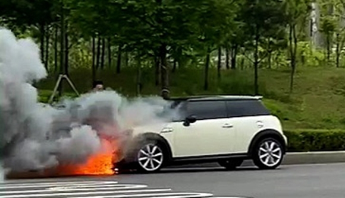

[image] fire6.jpg · 정답 위험 · 판정 위험(화재) ✅

판정 위험   유형 화재   설명 차량의 앞쪽 바퀴 부위에서 빠르게 번지는 연기와 함께 불꽃이 발생하고 있으며, 차량은 안전한 상태가 아님을 알 수 있음.

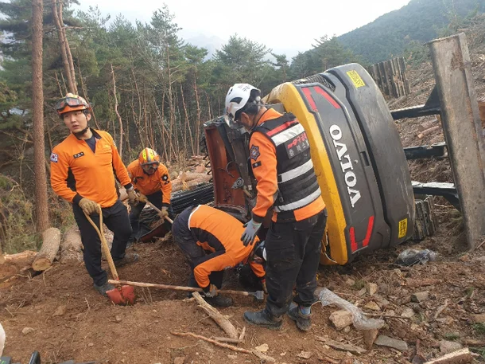

[image] machine_tipover1.webp · 정답 위험 · 판정 위험(낙상) ✅

판정 위험   유형 낙상   설명 산악 지역에서 기계가 떨어진 상태로 위험한 상황이며, 인근에는 구조대원들이 대응하고 있습니다.

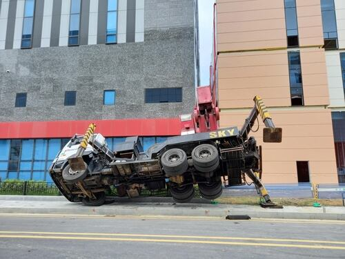

[image] machine_tipover2.jpg · 정답 위험 · 판정 위험(낙상) ✅

판정 위험   유형 낙상   설명 트럭이 완전히 바닥에 떨어져 있으며, 그 위에 있는 크레인 기구가 휘어져 있다. 이는 매우 위험한 상황이며, 트럭이 무너진 상태로 인해 주변에 위험물질이나 인명 피해가 발생할 수 있다. 즉, 이 장면은 낙상의 위험을 나타내며, 즉시 구조적 조치가 필요하다.

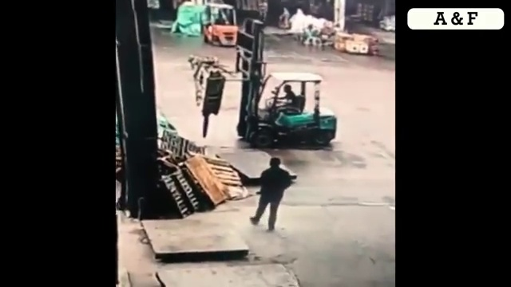

[image] machine_tipover3.jpg · 정답 위험 · 판정 위험(낙상) ✅

판정 위험   유형 낙상   설명 녹색 토목 기계가 운전사의 손을 잡고 있는 상태에서, 그 기계가 떨어질 위험이 존재합니다. 이는 기계의 안정성과 운전자의 조작 상태에 따라 결정됩니다.

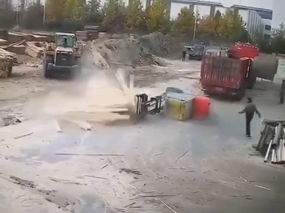

[image] machine_tipover4.jpg · 정답 위험 · 판정 위험(낙상) ✅

판정 위험   유형 낙상   설명 트럭이 뒤에서 떨어지는 듯한 모습이 보이며, 그 과정에서 먼지와 물이 방출되고 있다. 이는 낙상의 위험이 존재하며, 주변에는 다른 사람과 장비가 보인다.

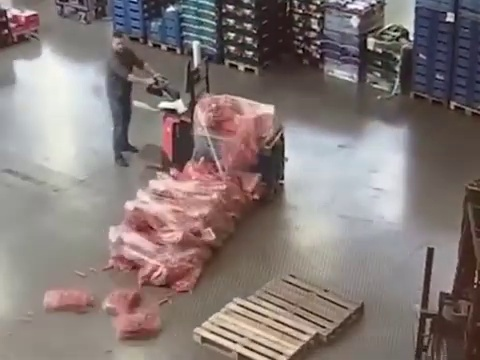

[image] machine_tipover5.jpg · 정답 위험 · 판정 위험(낙상) ✅

판정 위험   유형 낙상   설명 작업 중인 인물이 물건을 운반하는 데 중간에 떨어뜨린다. 이는 물건이 무게를 견딜 수 없는 상태로, 떨어질 가능성이 높아진다.

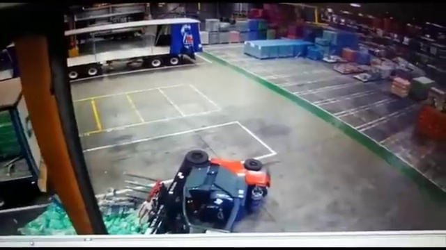

[image] machine_tipover6.jpg · 정답 위험 · 판정 위험(낙상) ✅

판정 위험   유형 낙상   설명 빨간색 트럭이 바닥에 떨어져 있으며, 그 위에 있는 물건들이 흩어져 있다. 이는 낙상의 위험을 나타내며, 사고의 심각성을 뒷받침한다. 즉, 이 장면은 위험한 상황을 나타냅니다.

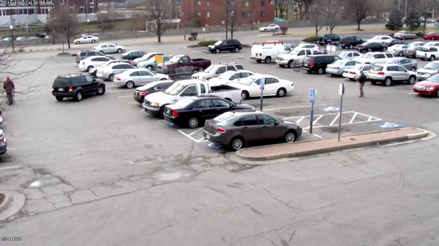

[image] normal_parking1.jpg · 정답 정상 · 판정 정상(없음) ✅

판정 정상   유형 없음   설명 화면에는 차량이 정차하고 있으며, 인물은 주변을 걷고 있는 것으로 보이며, 주변 환경은 안정적인 상태입니다. 다만, CCTV 이미지의 품질상 일부 영역이 흐릿하거나 불분명한 부분이 존재하지만, 현재 상황은 위험 요소가 없습니다.

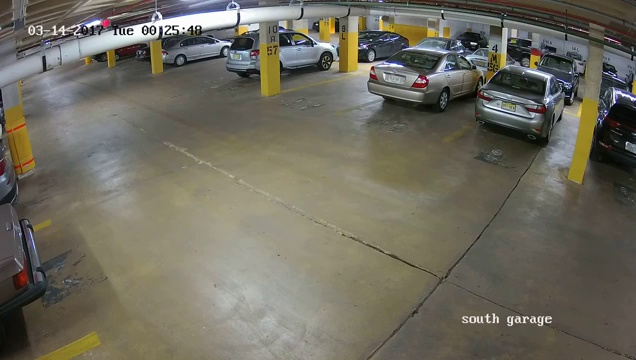

[image] normal_parking2.jpg · 정답 정상 · 판정 정상(없음) ✅

판정 정상   유형 없음   설명 이미지에는 차량이 정지해 있는 것으로 보이며, 인공지능이 감지한 위험 요소는 없습니다. 주변 환경은 안정적이고, 불안정한 상태나 위험한 물리적 요소가 보이지 않습니다.

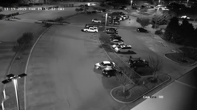

[image] normal_parking3.jpg · 정답 정상 · 판정 정상(없음) ✅

판정 정상   유형 없음   설명 화면에는 차량들이 정지된 상태로 주차되어 있으며, 불안정한 위치나 빠른 이동, 또는 불꽃 등 위험 요소가 보이지 않습니다. 주변 환경은 안정적이고, 조명도 충분하여 위험한 상황이 아닙니다.

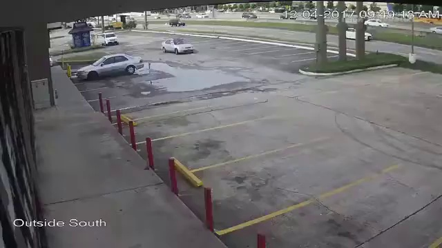

[image] normal_parking4.jpg · 정답 정상 · 판정 정상(없음) ✅

판정 정상   유형 없음   설명 화면에는 차량이 운행하고 있으며, 주차장과 도로가 보이며, 현재는 아무런 위험 요소가 보이지 않습니다.

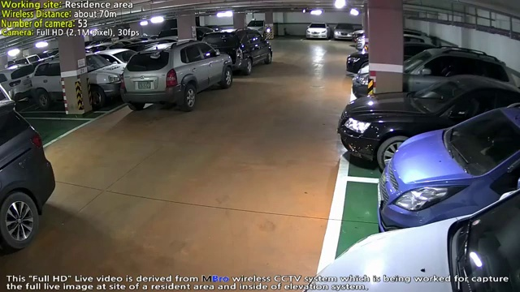

[image] normal_parking5.jpg · 정답 정상 · 판정 정상(없음) ✅

판정 정상   유형 없음   설명 화면에는 차량들이 정지된 상태로 주차되어 있으며, 주변에는 특별한 위험 요소나 불안정한 상태가 보이지 않습니다. CCTV 시스템의 기록 내용을 바탕으로, 현재 장면은 안전한 상태로 판단됩니다.

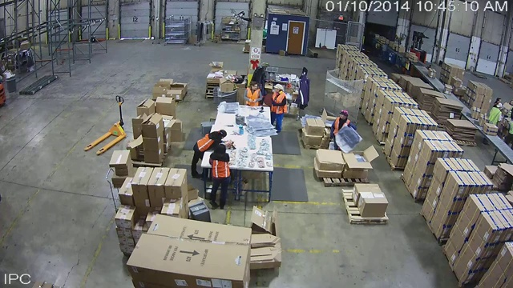

[image] normal_worker1.jpg · 정답 정상 · 판정 정상(없음) ✅

판정 정상   유형 없음   설명 화면에는 작업 중인 직원들과 수많은 박스가 보이며, 모든 장비와 인물은 안전하게 작동하고 있는 것으로 보입니다. 다만, 일부 박스가 흩어져 있는 상태는 있지만, 위험 요소는 없습니다.

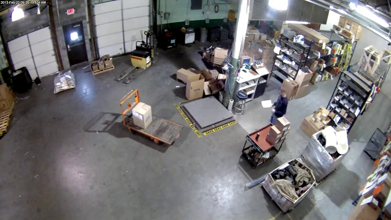

[image] normal_worker2.jpg · 정답 정상 · 판정 정상(없음) ✅

판정 정상   유형 없음   설명 장소는 공장 내부이며, 작업자와 물품이 정상적으로 배치되어 있으며, 위험 요소가 보이지 않습니다.

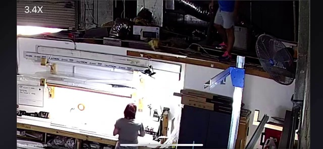

[image] normal_worker3.jpg · 정답 정상 · 판정 위험(낙상) ❌

판정 위험   유형 낙상   설명 상단에서 높은 위치에 있는 사람이 있는 것으로 보이며, 그 아래쪽에는 낙하 위험을 가진 물체가 존재함. 이는 낙상 위험을 나타내며, 즉 위험한 상황임을 의미함.

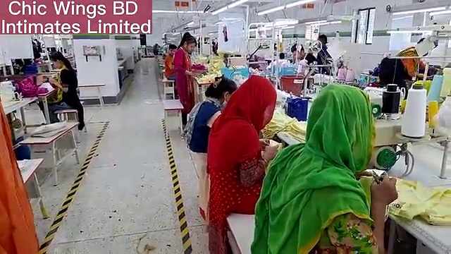

[image] normal_worker4.jpg · 정답 정상 · 판정 정상(없음) ✅

판정 정상   유형 없음   설명 공장 내부의 작업 공간에서 여러 명의 직원들이 작업을 하고 있으며, 안전 장비나 경고 시스템이 보이지 않아 위험 요소가 없습니다.

[image] normal_worker5.jpg · 정답 정상 · 판정 정상(없음) ✅

판정 정상   유형 없음   설명 재난 현장의 엣지 카메라로 캡처된 장면에서, 두 사람이 밀폐된 공간 내에 큰 수량의 상자와 포장재를 운반하고 있으며, 이는 일반적인 물류 작업의 일환으로 보입니다. 주변에는 다른 상자와 포장재가 높이 쌓여 있고, 이는 정상적인 작업 환경을 나타냅니다. 그러나 이 장면은 위험 요소가 포함되어 있지 않으며, 현재의 상태에서는 위험을 나타내는 요소가 없습니다.

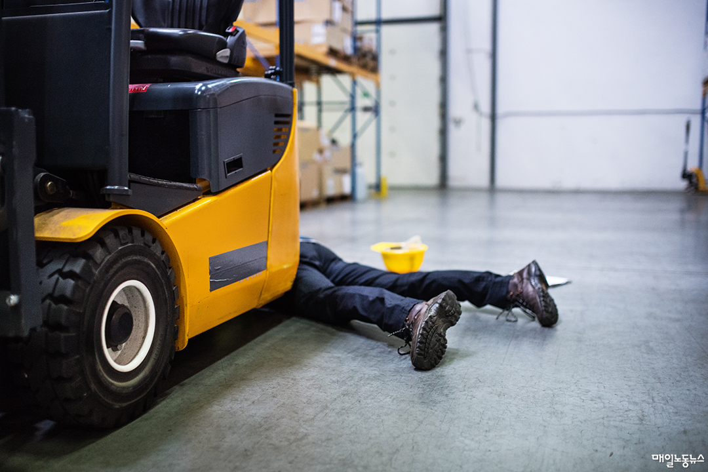

[image] person_fall1.jpg · 정답 위험 · 판정 위험(낙상) ✅

판정 위험   유형 낙상   설명 작업자가 포크세터에 부딪혀 넘어진 상태이며, 이는 높은 위험을 의미합니다. 작업자의 안전을 보장하기 위해 즉각적인 조치가 필요합니다.

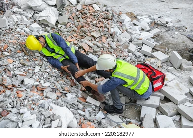

[image] person_fall2.webp · 정답 위험 · 판정 위험(낙상) ✅

판정 위험   유형 낙상   설명 작업 중인 인물이 무릎을 꿇고 넘어진 상태이며, 주변에는 건설 현장의 폐쇄된 콘크리트 조각들이 뒤섞여 있어, 낙상 위험이 매우 높습니다. 이는 즉각적인 구조적 안전 조치가 필요합니다.

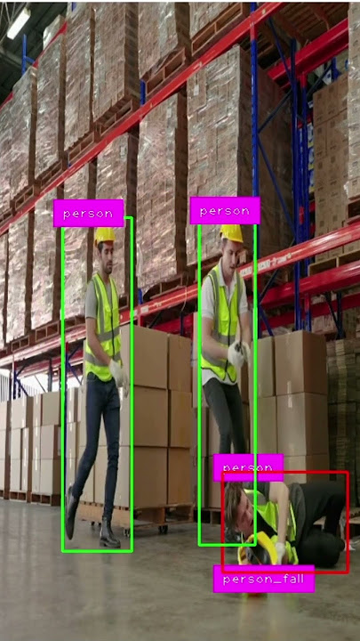

[image] person_fall3.jpg · 정답 위험 · 판정 위험(낙상) ✅

판정 위험   유형 낙상   설명 이미지 하단에는 작업복을 입은 인물이 바닥에 무릎을 꿇고 있으며, 그의 몸이 바닥에 떨어진 상태로 보이며, 이는 낙상의 위험을 나타냅니다.

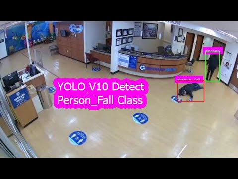

[image] person_fall4.jpg · 정답 위험 · 판정 위험(낙상) ✅

판정 위험   유형 낙상   설명 화면에 보이는 인물이 바닥에 떨어진 상태이며, 이는 낙상의 위험을 나타냅니다. 이는 즉각적인 위험을 초래할 수 있으며, 즉각적인 조치가 필요합니다.

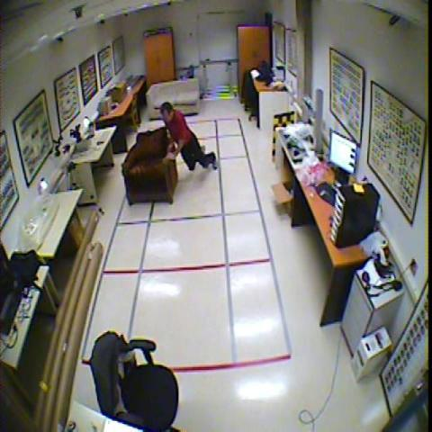

[image] person_fall5.jpg · 정답 위험 · 판정 위험(낙상) ✅

판정 위험   유형 낙상   설명 방 안에 사람이 무릎을 꿇고 바닥에 떨어진 상태로 누워 있으며, 이는 낙상 위험을 나타냅니다. 이는 위험한 상황이며, 즉시 조치가 필요합니다.

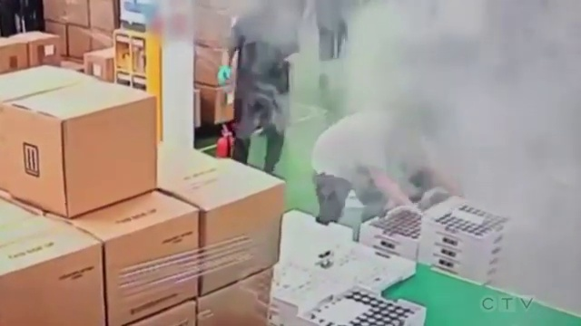

[image] smoke1.jpg · 정답 위험 · 판정 위험(화재) ✅

판정 위험   유형 화재   설명 화재 발생 후 연기와 함께 인원이 무릎을 꿇고 있는 상태이며, 주변에는 흐릿한 연기와 함께 여러 개의 박스가 놓여 있다. 이는 화재의 진행 상황을 나타내며, 즉시 구조 및 안전 조치가 필요하다.

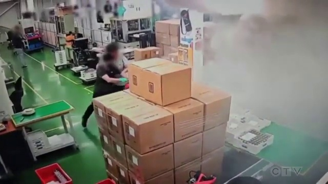

[image] smoke2.jpg · 정답 위험 · 판정 위험(화재) ✅

판정 위험   유형 화재   설명 화재 발생 후 연기와 불꽃이 확산되고 있으며, 작업자들이 급히 뒤로 물러나는 상황. 이는 매우 심각한 위험을 나타내며, 즉시 구조 및 안전 조치가 필요합니다.

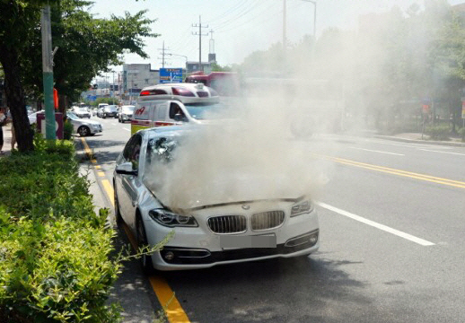

[image] smoke3.jpg · 정답 위험 · 판정 위험(화재) ✅

판정 위험   유형 화재   설명 차량의 앞부분에서 밀집된 연기와 함께 빛이 흐르는 상태로, 차량이 불이 나는 것으로 보이며, 이는 매우 심각한 위험을 나타냅니다. 즉, 차량이 화재 상태에 있으며, 즉시 구조대가 대응해야 합니다.

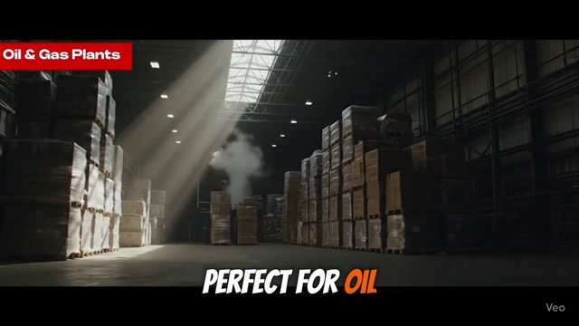

[image] smoke4.jpg · 정답 위험 · 판정 정상(없음) ❌

판정 정상   유형 없음   설명 화면에는 오일 및 가스 플랜트 관련 장비가 보이며, 실내는 잘 관리된 상태로 보이며, 불안정한 상태나 위험한 사태가 나타나지 않습니다. 다만, 빛이 강하게 들어오는 부분에서 연기의 존재는 있지만, 그 안에 화재나 폭발의 징후가 없습니다.

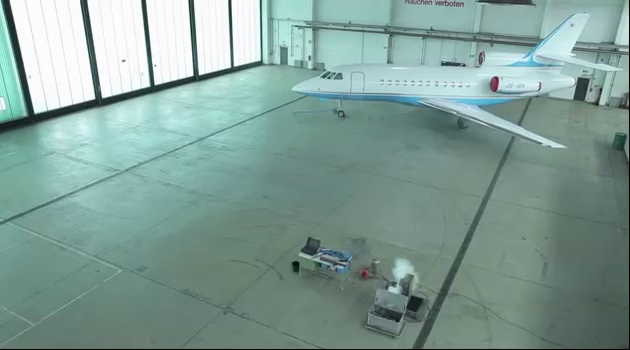

[image] smoke5.jpg · 정답 위험 · 판정 위험(화재) ✅

판정 위험   유형 화재   설명 이미지 하단에는 연기와 함께 불꽃이 나는 장비가 보이며, 이는 화재 발생의 시각적 증거입니다. 이는 즉각적인 위험을 나타내며, 즉시 대응이 필요합니다.

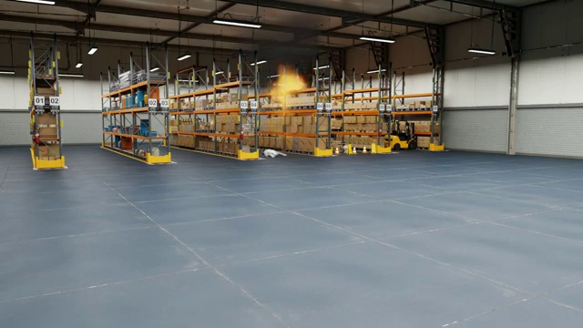

[image] smoke_fire1.jpg · 정답 위험 · 판정 위험(화재) ✅

판정 위험   유형 화재   설명 화재가 발생한 것으로 보이며, 빛이 흐르는 상태로 인해 위험한 상황이 발생하고 있습니다.

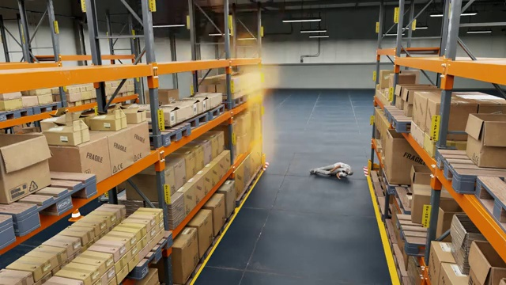

[image] smoke_fire2.jpg · 정답 위험 · 판정 위험(낙상) ✅

판정 위험   유형 낙상   설명 화면 중앙에 인물이 바닥에 누워 있으며, 그 주변에는 빛이 나는 불꽃이 발생하고 있다. 이는 낙상 위험이 존재하는 것으로 보이며, 인물의 상태가 위험한 상황임을 나타낸다.

